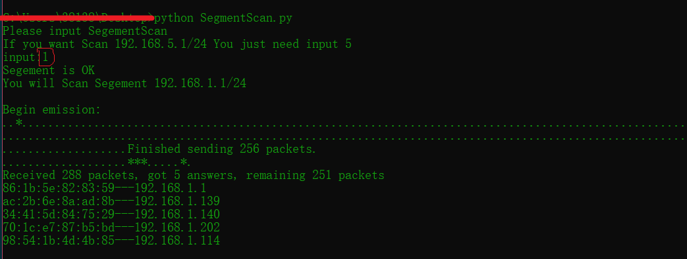
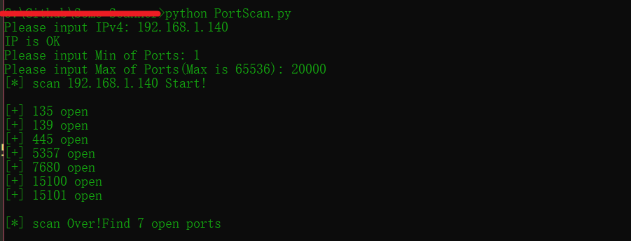

### 一些简单的扫描器
### 一、局域网网段扫描
[SegmentScan.py](SegmentScan.py)
只需输入网段           

### 二、端口扫描(目前只支持输入ipv4)
[PortScan.py](PortScan.py)
输入Ipv4           
输入扫描端口最小值，要求>=0 

输入扫描端口最大值，要求<=65536          

